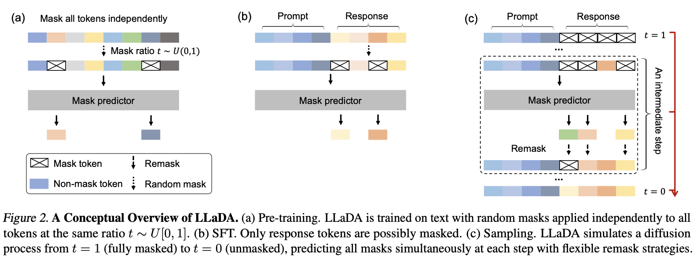

# Modèles de diffusion pour LLM

## de l’Autoregression à la Diffusion

Les modèles de langage classiques génèrent du texte de manière autoregressive, où chaque mot est prédit en fonction du précédent. Bien que cette approche soit efficace, elle présente certaines limites, notamment des coûts de calcul élevés et des contraintes dans le raisonnement inverse. Récemment, des chercheurs ont exploré une alternative : l'utilisation des modèles de diffusion pour générer du texte.

Les modèles de diffusion sont couramment utilisés pour créer des images, où une image démarre sous forme de bruit aléatoire avant d’être progressivement affinée à l’aide d’un prompt. Un principe similaire est appliqué au modèle LLaDA (Large Language Diffusion with Masking) pour la génération de texte. Plutôt que de prédire chaque mot individuellement, LLaDA commence avec une séquence partiellement masquée et reconstitue progressivement les mots manquants au fil de plusieurs étapes d’affinement.

## Comment fonctionne LLaDA ? 

1. Pré-entraînement
- Le modèle est entraîné sur un ensemble de données comprenant 2,3 billions de tokens.
- Une séquence de texte est masquée aléatoirement selon différents taux.
Un prédicteur de masque, basé sur un modèle transformeur, apprend à restaurer les mots manquants.
- Contrairement aux modèles autoregressifs, LLaDA bénéficie d’un contexte bidirectionnel, lui permettant de prendre en compte à la fois les mots précédents et suivants pour ses prédictions.

2. SFT - Supervised Fine-Tuning
- Le modèle est affiné pour mieux répondre aux instructions données dans un prompt.
- Lors de cette phase, seule la réponse est masquée tandis que le prompt reste intact.
- Il apprend à générer des réponses en complétant progressivement les parties masquées, renforçant ainsi sa capacité à combler intelligemment les lacunes.

3. Génération de Texte
- Lorsqu’un prompt est fourni, le modèle démarre avec une réponse entièrement masquée.
- Grâce à un processus itératif de diffusion inversée, il dévoile progressivement les mots manquants.
- Plutôt que de tout révéler en une seule fois, il remasque certaines prédictions incertaines afin de les affiner à chaque itération.
- Cette méthode améliore la cohérence et la qualité des réponses, tout en optimisant l’efficacité du calcul.

## Pourquoi cette approche est-elle importante ?

- LLaDA offre des performances comparables aux LLMs traditionnels tout en nécessitant moins de tokens d'entraînement et en évitant le recours à l’apprentissage par renforcement basé sur le feedback humain.

- Les tâches nécessitant un raisonnement inversé, comme la complétion de texte dans l’ordre inverse, bénéficient du traitement bidirectionnel de LLaDA.

- LLaDA peut également combiner la diffusion et l’autoregression. En divisant la génération de texte en blocs, le modèle affine progressivement chaque section tout en maintenant une cohérence globale.

### → https://arxiv.org/pdf/2502.09992 